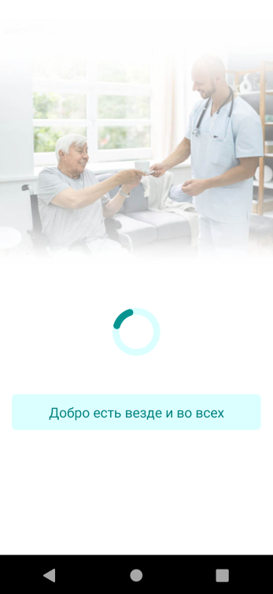

# Дипломный проект профессии «Мобильный тестировщик»

Дипломный проект представляет собой тестирование и автоматизацию мобильного приложения "Мобильный хоспис".

## Как правильно работать над дипломом?

Что следует делать, чтобы все получилось: 
1. Попробовать найти ответ сначала самому в интернете. Ведь, именно скилл поиска ответов пригодится вам на первой работе. И только после этого спрашивать дипломного руководителя.
1. В одном вопросе должна быть заложена одна проблема.
1. Как правильно оформлять вопросы:
    - публикуете самую последнюю версию вашего кода на GitHub
    - включаете в репозитории Issues
    - заводите новое Issue, в котором пишете:
        - в чём проблема;
        - прикладываете скриншот (чтобы все понимали куда смотреть);
        - если в консоли любого сервиса есть ошибки - не поленитесь скопировать их тоже (не отпринскринить, а скопировать - Ctrl + C, Ctrl + V).
1. Начинать работу над дипломом как можно раньше! Чтобы было больше времени на правки. 
1. Делать диплом по частям, а не все сразу. Иначе, есть шанс, что нужно будет все переделывать :)  

Что следует делать, чтобы ничего не получилось: 
1. Никому ничего не говорить.
1. Писать вопросы вида “Я не знаю, что делать. Я ничего не понял. Ничего не работает. Не запускается. Всё работало, а теперь не работает. Да и вообще никогда не работало.”
1. Думать “вы такого не проходили, вас к этому не готовили и вообще, почему всё так сложно???“
1. Присылать скриншоты (или ещё хуже - фотографии экрана), не показывая код.
1. Откладывать диплом на потом.
1. Ждать того, что оно "заработает само".
1. Ждать ответ на свой вопрос моментально. Дипломные руководители - работающие специалисты, которые занимаются кроме преподавания, своими проектами. Их время ограничено, поэтому постарайтесь задавать правильные вопросы, чтобы получать быстрые ответы! 

В любом случае: задавайте вопрос, вы обязательно получите на него ответ.

## Описание приложения

### Бизнес часть

Приложение представляет из себя клиент-серверное по.

Приложение предостовляет функционал по работе с притензиями хосписа и включает в себя:
1. Информацию о притензиях и функционал для работы с ними
2. Новостную сводку хосписа
3. Тематические цитаты

*Важно: Приложение оперирует данными с сервера, так что при проверке их не стоит менять и тем более удалять*

### Техническая часть

Само приложение расположено в директории fmh-android.

Данные для авторизации можно получить у дипломного руководителя.

## Задачи

Ваши основные задача:
 1) Проверить основную функциональность приложения без изменения данных и составить чек-лист
 2) Автоматизировать проверку чек-листа

Задачи разбиты на этапы:
1. Знакомство с приложением
1. Проверка приложения и составление чек-листа
1. Автоматизация проверки приложения по чек-листу
1. Подготовке отчётных документов по итогам тестирования
1. Подготовка отчётных документов по итогам автоматизации

Все материалы (документы, авто-тесты, открытые issue, отчёты и т.д.) должны быть размещены в одном публичном репозитории, ссылку на который вы и будете отправлять дипломному руководителю.

### Планирование

После начала работы над дипломом в течение 3 рабочих дней вы должны сдать дипломному руководителю план автоматизации, в котором описано:

* Перечень автоматизируемых сценариев
* Перечень используемых инструментов (библиотек) с обоснованием выбора
* Перечень и описание возможных рисков при автоматизации
* Интервальная оценка с учётом рисков (в часах)
* План сдачи работ (когда будут авто-тесты, результаты их прогона и отчёт по автоматизации)

Отчёт оформляется в виде файла с именем `Plan.md` и заливается в репозиторий вашего проекта.

### Автоматизация

На этом этапе вы непосредственно пишете авто-тесты и прогоняете их. Требования по подключению CI нет, но есть требования к самим тестам:
* Обязательно должны быть тесты UI
* Обязательно должны быть репорты (Gradle и Allure)

Код авто-тестов заливается в ваш репозиторий вместе со всеми отчётными документами.

В файле `README.md` должна быть описана процедура запуска авто-тестов (если для запуска необходимо заранее установить, настроить, запустить какое-то ПО - это тоже должно быть описано).

**Важно: дипломный руководитель не будет за вас "допридумывать" как запускать ваши тесты, если после `git clone` и выполнения шагов, описанные в `README.md` авто-тесты не запускаются, то диплом отправляется на доработку.**

### Отчётные документы по итогам тестирования

В качестве отчётных документов прикладываются issue со скриншотами и описанием багов + формируется документ `Report.md`, в котором содержится отчёт о проведённом тестировании:
* Краткое описание
* Количество тест-кейсов
* % успешных/не успешных
* Общие рекомендации

Не забудьте о том, что помимо документа, в систему автоматизации должны быть интегрированы отчёты: Gradle или Allure.

### Отчётные документы по итогам автоматизации

В качестве отчётных документов формируется документ `Summary.md`, в котором содержится отчёт о проведённой автоматизации:
* Что было запланировано и что было сделано
* Причины, по которым что-то не было сделано
* Сработавшие риски
* Общий итог по времени (сколько запланировали/сколько потратили с обоснованием расхождения)

## О документах

Важно: когда мы просим вас написать любые документы - мы не требуем творений на 10 страниц, документ должен, максимум, занимать один лист A4.

## О требованиях

Когда вы придёте на работу, то нужно делать так, как требует тот, кто ставит задачи. Естественно, это можно обсуждать, но ключевое - заранее привыкнуть к тому, что придётся подстраиваться под стиль работы команды и это (смена стиля) - не должно вызывать у вас дискомфорта (вы должны быть к этому готовы). Постановщик задач в данном случае для вас - дипломный руководитель. И если дипломный руководитель требует что-то изменить/добавить/скорректировать - то это нужно сделать даже несмотря на то, что ДЗ у вас принимались в том виде, в котором вы делаете сейчас. Это часть обучения.

## Expert Level

*Важно: выполнение или не выполнение этого раздела не влияет на получение диплома*

Если вы чувствуете в себе силы и готовы самостоятельно поизучать информацию на просторах интернета, то предлагаем вам расширить отчет Allure добавлением шагов и скриншотов.
